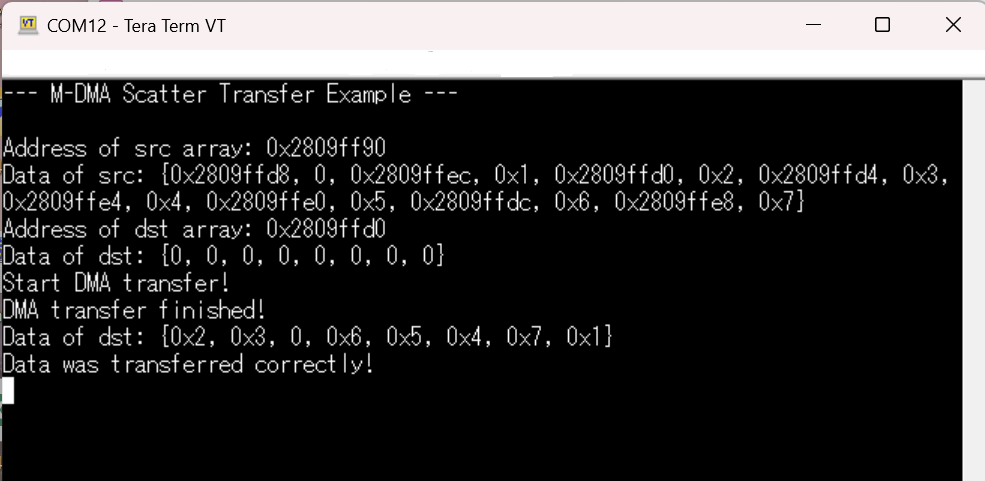
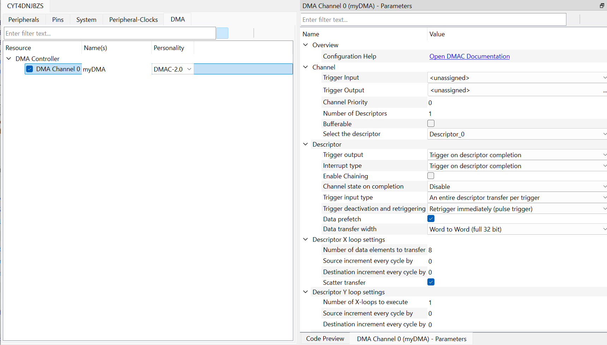

# PDL: M-DMA Scatter Transfer
This code example demonstrates how to use the scatter functionality of the M-DMA block

[View this README on GitHub.](https://github.com/Infineon/mtb-example-ce240944-mdma-scatter)

[Provide feedback on this code example.](https://yourvoice.infineon.com/jfe/form/SV_1NTns53sK2yiljn?Q_EED=eyJVbmlxdWUgRG9jIElkIjoiQ0UyNDA5MzgiLCJTcGVjIE51bWJlciI6IjAwMi00MDkzOCIsIkRvYyBUaXRsZSI6IlBETDogTS1ETUEgU2NhdHRlciBUcmFuc2ZlciIsInJpZCI6Im1hc2FoaWRlLmthcmlub0BpbmZpbmVvbi5jb20iLCJEb2MgdmVyc2lvbiI6IjIuMS4wIiwiRG9jIExhbmd1YWdlIjoiRW5nbGlzaCIsIkRvYyBEaXZpc2lvbiI6Ik1DRCIsIkRvYyBCVSI6IkFVVE8iLCJEb2MgRmFtaWx5IjoiQVVUTyBNQ1UifQ==)

## Requirements

- [ModusToolbox&trade;](https://www.infineon.com/modustoolbox) v3.6 or later (tested with v3.6)
- Board support package (BSP) minimum required version: 3.0.0
- Programming language: C
- Associated parts: [TRAVEO&trade; T2G family Cluster series](https://www.infineon.com/cms/en/product/microcontroller/32-bit-traveo-t2g-arm-cortex-microcontroller/32-bit-traveo-t2g-arm-cortex-for-cluster/), [TRAVEO&trade; T2G family body high CYT4BF series](https://www.infineon.com/products/microcontroller/32-bit-traveo-t2g-arm-cortex/for-body/t2g-cyt4bf)

## Supported toolchains (make variable 'TOOLCHAIN')

- GNU Arm&reg; Embedded Compiler v14.2.1 (`GCC_ARM`) – Default value of `TOOLCHAIN`
- Arm&reg; Compiler v6.22 (`ARM`)
- IAR C/C++ Compiler v9.50.2 (`IAR`)

## Supported kits (make variable 'TARGET')


- [TRAVEO&trade; T2G Cluster 6M Lite Kit](https://www.infineon.com/cms/en/product/evaluation-boards/kit_t2g_c-2d-6m_lite/) (`KIT_T2G_C-2D-6M_LITE`) – Default value of `TARGET`
- [TRAVEO&trade; T2G Cluster 4M Lite Kit](https://www.infineon.com/evaluation-board/KIT-T2G-C-2D-4M-LITE) (`KIT_T2G_C-2D-4M_LITE`)
- [TRAVEO&trade; T2G Body high Lite Kit](https://www.infineon.com/evaluation-board/KIT-T2G-B-H-LITE) (`KIT_T2G-B-H_LITE`)
- [TRAVEO&trade; T2G Body high Evaluation Kit](https://www.infineon.com/evaluation-board/KIT-T2G-B-H-EVK) (`KIT_T2G-B-H_EVK`)

## Hardware setup

This example uses the board's default configuration. See the kit user guide to ensure that the board is configured correctly.


## Software setup

See the [ModusToolbox&trade; tools package installation guide](https://www.infineon.com/ModusToolboxInstallguide) for information about installing and configuring the tools package.

Install a terminal emulator if you don't have one. Instructions in this document use [Tera Term](https://teratermproject.github.io/index-en.html).

This example requires no additional software or tools.


## Using the code example

### Create the project

The ModusToolbox&trade; tools package provides the Project Creator as both a GUI tool and a command line tool.

<details><summary><b>Use Project Creator GUI</b></summary>

1. Open the Project Creator GUI tool.

   There are several ways to do this, including launching it from the dashboard or from inside the Eclipse IDE. For more details, see the [Project Creator user guide](https://www.infineon.com/ModusToolboxProjectCreator) (locally available at *{ModusToolbox&trade; install directory}/tools_{version}/project-creator/docs/project-creator.pdf*).

2. On the **Choose Board Support Package (BSP)** page, select a kit supported by this code example. See [Supported kits](#supported-kits-make-variable-target).

   > **Note:** To use this code example for a kit not listed here, you may need to update the source files. If the kit does not have the required resources, the application may not work.

3. On the **Select Application** page:

   a. Select the **Applications(s) Root Path** and the **Target IDE**.

   > **Note:** Depending on how you open the Project Creator tool, these fields may be pre-selected for you.

   b.	Select this code example from the list by enabling its check box.

   > **Note:** You can narrow the list of displayed examples by typing in the filter box.

   c. (Optional) Change the suggested **New Application Name** and **New BSP Name**.

   d. Click **Create** to complete the application creation process.

</details>

<details><summary><b>Use Project Creator CLI</b></summary>

The 'project-creator-cli' tool can be used to create applications from a CLI terminal or from within batch files or shell scripts. This tool is available in the *{ModusToolbox&trade; install directory}/tools_{version}/project-creator/* directory.

Use a CLI terminal to invoke the 'project-creator-cli' tool. On Windows, use the command-line 'modus-shell' program provided in the ModusToolbox&trade; installation instead of a standard Windows command-line application. This shell provides access to all ModusToolbox&trade; tools. You can access it by typing "modus-shell" in the search box in the Windows menu. In Linux and macOS, you can use any terminal application.


The following example clones the "[mtb-example-ce240944-mdma-scatter](https://github.com/Infineon/mtb-example-ce240944-mdma-scatter)" application with the desired name "MdmaScatter" configured for the *KIT_T2G_C-2D-6M_LITE* BSP into the specified working directory, *C:/mtb_projects*:

   ```
   project-creator-cli --board-id KIT_T2G_C-2D-6M_LITE --app-id mtb-example-ce240944-mdma-scatter --user-app-name MdmaScatter --target-dir "C:/mtb_projects"
   ```


The 'project-creator-cli' tool has the following arguments:

Argument | Description | Required/optional
---------|-------------|-----------
`--board-id` | Defined in the <id> field of the [BSP](https://github.com/Infineon?q=bsp-manifest&type=&language=&sort=) manifest | Required
`--app-id`   | Defined in the <id> field of the [CE](https://github.com/Infineon?q=ce-manifest&type=&language=&sort=) manifest | Required
`--target-dir`| Specify the directory in which the application is to be created if you prefer not to use the default current working directory | Optional
`--user-app-name`| Specify the name of the application if you prefer to have a name other than the example's default name | Optional

> **Note:** The project-creator-cli tool uses the `git clone` and `make getlibs` commands to fetch the repository and import the required libraries. For details, see the "Project creator tools" section of the [ModusToolbox&trade; tools package user guide](https://www.infineon.com/ModusToolboxUserGuide) (locally available at {ModusToolbox&trade; install directory}/docs_{version}/mtb_user_guide.pdf).

</details>


### Open the project

After the project has been created, you can open it in your preferred development environment.


<details><summary><b>Eclipse IDE</b></summary>

If you opened the Project Creator tool from the included Eclipse IDE, the project will open in Eclipse automatically.

For more details, see the [Eclipse IDE for ModusToolbox&trade; user guide](https://www.infineon.com/MTBEclipseIDEUserGuide) (locally available at *{ModusToolbox&trade; install directory}/docs_{version}/mt_ide_user_guide.pdf*).

</details>


<details><summary><b>Visual Studio (VS) Code</b></summary>

Launch VS Code manually, and then open the generated *{project-name}.code-workspace* file located in the project directory.

For more details, see the [Visual Studio Code for ModusToolbox&trade; user guide](https://www.infineon.com/MTBVSCodeUserGuide) (locally available at *{ModusToolbox&trade; install directory}/docs_{version}/mt_vscode_user_guide.pdf*).

</details>


<details><summary><b>Keil µVision</b></summary>

Double-click the generated *{project-name}.cprj* file to launch the Keil µVision IDE.

For more details, see the [Keil µVision for ModusToolbox&trade; user guide](https://www.infineon.com/MTBuVisionUserGuide) (locally available at *{ModusToolbox&trade; install directory}/docs_{version}/mt_uvision_user_guide.pdf*).

</details>


<details><summary><b>IAR Embedded Workbench</b></summary>

Open IAR Embedded Workbench manually, and create a new project. Then select the generated *{project-name}.ipcf* file located in the project directory.

For more details, see the [IAR Embedded Workbench for ModusToolbox&trade; user guide](https://www.infineon.com/MTBIARUserGuide) (locally available at *{ModusToolbox&trade; install directory}/docs_{version}/mt_iar_user_guide.pdf*).

</details>


<details><summary><b>Command line</b></summary>

If you prefer to use the CLI, open the appropriate terminal, and navigate to the project directory. On Windows, use the command-line 'modus-shell' program; on Linux and macOS, you can use any terminal application. From there, you can run various `make` commands.

For more details, see the [ModusToolbox&trade; tools package user guide](https://www.infineon.com/ModusToolboxUserGuide) (locally available at *{ModusToolbox&trade; install directory}/docs_{version}/mtb_user_guide.pdf*).

</details>

## Operation


1. Connect the board to your PC using the provided USB cable through the KitProg3 USB connector.

2. Open a terminal program and select the KitProg3 COM port. Set the serial port parameters to '8N1' and '115200' baud.

3. Program the board using one of the following:

   <details><summary><b>Using Eclipse IDE</b></summary>

      1. Select the application project in the Project Explorer.

      2. In the **Quick Panel**, scroll down, and click **\<Application Name> Program (KitProg3_MiniProg4)**.
   </details>


   <details><summary><b>In other IDEs</b></summary>

   Follow the instructions in your preferred IDE.
   </details>


   <details><summary><b>Using CLI</b></summary>

     From the terminal, execute the `make program` command to build and program the application using the default toolchain to the default target. The default toolchain is specified in the application's Makefile but you can override this value manually:
      ```
      make program TOOLCHAIN=<toolchain>
      ```

      Example:
      ```
      make program TOOLCHAIN=GCC_ARM
      ```

    </details>

4. After programming, the application starts automatically. Confirm that the messages are displayed on the UART terminal.


**Figure 1.  Terminal output on program startup**

   


  
<br/>


## Debugging

You can debug the example to step through the code.


<details><summary><b>In Eclipse IDE</b></summary>

Use the **\<Application Name> Debug (KitProg3_MiniProg4)** configuration in the **Quick Panel**. For details, see the "Program and debug" section in the [Eclipse IDE for ModusToolbox&trade; user guide](https://www.infineon.com/MTBEclipseIDEUserGuide).


</details>


<details><summary><b>In other IDEs</b></summary>

Follow the instructions in your preferred IDE.
</details>


## Design and implementation


This example consists of one M-DMA scatter transfer started by software. There is a *src[]*, *dst[]* and *REFERENCE[]* array. The first one contains the layout of the scatter transfer (address and data pair), and the second one holds the data after the transfer. Inside the *REFERENCE[]* array lies the data expected to be seen in *dst[]* after the transfer. It will be compared in the end.

*Note: All arrays are put onto the stack of the main function. To configure the src[] array, addresses of dst[] are used by the &-operator and casted into unsigned integers.*

**STDOUT**

At all steps, current information is printed onto UART and can be read via the terminal program. A helper function *printArrayToUART()* is provided to print a whole array. This is used to indicate the current elements of the arrays and to verify that the data is correct in the end.

Initialization of the GPIO for UART is done in the <a href="https://infineon.github.io/retarget-io/html/group__group__board__libs.html#ga4905a76eaea9b40111887f5b6ff7d252"><i>cy_retarget_io_init()</i></a> function.
- Initializes the pin specified by *CYBSP_DEBUG_UART_TX* as UART TX and the pin specified by *CYBSP_DEBUG_UART_RX* as UART RX (these pins are connected to KitProg3 COM port)
- The serial port parameters are 8N1 and 115200 baud

**LED**

The user LED is initialized and will lighten up if the verification at the end of the transfer is successful. Initialization is done via Peripheral Driver Library (PDL) in <a href="https://infineon.github.io/mtb-pdl-cat1/pdl_api_reference_manual/html/group__group__gpio__functions__init.html#gad61553f65d4e6bd827eb6464a7913461"><i>Cy_GPIO_Pin_Init()</i></a>. LED is turned on via <a href="https://infineon.github.io/mtb-pdl-cat1/pdl_api_reference_manual/html/group__group__gpio__functions__gpio.html#ga849c813d6771bf8d3c59b89b28a07bca"><i>Cy_GPIO_Write()</i></a>.

**M-DMA**

To configure M-DMA, the Device Configurator is used.

   **Figure 2. Device configurator for M-DMA**<BR>

As a resource, the "DMA Controller" is chosen, which is synonymous with M-DMA. "DMA DataWire 0" and "DMA DataWire 1" reflect the two P-DMA controllers available on this device.

When configuring the DMA, *Trigger Input* and *Trigger Output* can be specified. This is used to automatically start or trigger other peripherals via the Trigger Multiplexer available on TRAVEO™ T2G. In this example, the transfer is started manually in software, therefore no signals are needed here.

Further, one or multiple descriptors must be specified. A descriptor is a small part of memory for the DMA to keep track of the current state (like the current source address). Since descriptor chaining is supported, more than one can be specified. In this example, only one is used.

In the descriptor configuration, only the data transfer width is important in this example because 32-bit words are used. No triggering and no interrupts are used (the end will be checked by polling) but can be configured here.

In the X loop settings, 8 elements to copy are specified, even though the source array contains 16 elements. This is because effectively only 8 elements are copied, twice as much is needed for the addresses. As long as scatter transfer is checked, what is done here, DMA will do it properly. No increment on source and destination is needed.

In the Y loop settings, the number of X-loops is set to 1 and all other values to 0. These are default settings for 1D and scatter transfers and are changed when using 2D transfers.

The config is stored in Flash since it will not be changed in the code.

When finished, the configurator provides the following values:
- *myDMA_Descriptor_0* of type <a href="https://infineon.github.io/mtb-pdl-cat1/pdl_api_reference_manual/html/structcy__stc__dmac__descriptor__t.html"><i>cy_stc_dmac_descriptor_t</i></a>.
- *myDMA_Descriptor_0_config* of type <a href="https://infineon.github.io/mtb-pdl-cat1/pdl_api_reference_manual/html/structcy__stc__dmac__descriptor__config__t.html"><i>cy_stc_dmac_descriptor_config_t</i></a>.
- *myDMA_channelConfig* of type <a href="https://infineon.github.io/mtb-pdl-cat1/pdl_api_reference_manual/html/structcy__stc__dmac__channel__config__t.html"><i>cy_stc_dmac_channel_config_t</i></a>.
- *myDMA_HW* macro
- *myDMA_CHANNEL* macro

These have to be used in conjunction with the right functions, as demonstrated in the code. The only addition is to specify the source address via <a href="https://infineon.github.io/mtb-pdl-cat1/pdl_api_reference_manual/html/group__group__dmac__descriptor__functions.html#ga6b71b6054e4e16bb3ba58bfdd5bab2cc"><i>Cy_DMAC_Descriptor_SetSrcAddress()</i></a> explicitly. This cannot be done in the configurator because the addresses are mostly dependent on the application, like in this case the location on the stack. For this, the pointer to the *src[]* array is provided.


**Trigger DMA via software**

To start the DMA transfer via software, it must be manually triggered via *Trigger Multiplexer* (TrigMUX). In the PDL, the function <a href="https://infineon.github.io/mtb-pdl-cat1/pdl_api_reference_manual/html/group__group__trigmux.html#ga882218319ecd105dede8b382e9a1c4a4"><i>Cy_TrigMux_SwTrigger()</i></a> is available. The trigger line corresponding to the used DMA channel can be found in the datasheet.

**Transfer finish**

To see if the transfer is finished, the status is polled via <a href="https://infineon.github.io/mtb-pdl-cat1/pdl_api_reference_manual/html/group__group__dmac__channel__functions.html#ga7fe55ddff581132a9d35f03cd5941cf8"><i>Cy_DMAC_Channel_GetInterruptStatus()</i></a> and checked against the corresponding bitmask <a href="https://infineon.github.io/mtb-pdl-cat1/pdl_api_reference_manual/html/group__group__dmac__macros__interrupt__masks.html#gafdba1f920225bf6f028437646a5613a0"><i>CY_DMAC_INTR_COMPLETION</i></a>.

**Verification**

After the transfer, the data is checked against the reference array. For this, *memcmp()* of the standard library is used, which checks if all bytes in the memory are equal. If verification was successful, it is printed onto the serial monitor and the LED turns on.


## Related resources  

Resources  | Links
-----------|----------------------------------
Application notes  | [AN235305](https://www.infineon.com/assets/row/public/documents/10/42/infineon-an235305-getting-started-with-traveo-t2g-family-mcus-in-modustoolbox-applicationnotes-en.pdf) – Getting started with TRAVEO&trade; T2G family MCUs in ModusToolbox&trade; <br /> [AN220191](https://www.infineon.com/row/public/documents/10/42/infineon-an220191---how-to-use-direct-memory-access-dma-controller-in-traveot2g-family-applicationnotes-en.pdf) - HOW TO USE DIRECT MEMORY ACCESS(DMA) CONTROLLER IN TRAVEO™ II FAMILY<br /> [AN224432](https://www.infineon.com/row/public/documents/10/42/infineon-an224432---multi-core-handling-in-traveo-t2g-family-applicationnotes-en.pdf) - MULTI CORE HANDLING IN TRAVEO™ T2G FAMILY　
Code examples  | [Using ModusToolbox&trade;](https://github.com/Infineon/Code-Examples-for-ModusToolbox-Software) on GitHub
Device documentation | [TRAVEO&trade; T2G body high family MCUs datasheets](https://www.infineon.com/products/microcontroller/32-bit-traveo-t2g-arm-cortex/for-body/t2g-cyt4bf/#documents) <br> [TRAVEO&trade; T2G body high family MCUs architecture/registers reference manuals](https://www.infineon.com/products/microcontroller/32-bit-traveo-t2g-arm-cortex/for-body/t2g-cyt4bf/#documents) <br> [TRAVEO&trade; T2G cluster family MCUs datasheets for CYT4DN](https://www.infineon.com/products/microcontroller/32-bit-traveo-t2g-arm-cortex/for-cluster/#documents) <br> [TRAVEO&trade; T2G cluster family MCUs architecture/registers reference manuals for CYT4DN](https://www.infineon.com/products/microcontroller/32-bit-traveo-t2g-arm-cortex/for-cluster/#documents) <br> [TRAVEO&trade; T2G cluster family MCUs datasheets for CYT3DL](https://www.infineon.com/products/microcontroller/32-bit-traveo-t2g-arm-cortex/for-cluster/#documents) <br> [TRAVEO&trade; T2G cluster family MCUs architecture/registers reference manuals for CYT3DL](https://www.infineon.com/products/microcontroller/32-bit-traveo-t2g-arm-cortex/for-cluster/#documents) <br /> 
Development kits | Select your kits from the [Evaluation board finder](https://www.infineon.com/cms/en/design-support/finder-selection-tools/product-finder/evaluation-board).
Libraries on GitHub  | [mtb-pdl-cat1](https://github.com/Infineon/mtb-pdl-cat1) – Peripheral Driver Library (PDL) 　<br /> [retarget-io](https://github.com/Infineon/retarget-io) – Utility library to retarget STDIO messages to a UART port　
 <br /> Tools  | [ModusToolbox&trade;](https://www.infineon.com/modustoolbox) – ModusToolbox&trade; software is a collection of easy-to-use libraries and tools enabling rapid development with Infineon MCUs for applications ranging from wireless and cloud-connected systems, edge AI/ML, embedded sense and control, to wired USB connectivity using PSOC&trade; Industrial/IoT MCUs, AIROC&trade; Wi-Fi and Bluetooth&reg; connectivity devices, XMC&trade; Industrial MCUs, and EZ-USB&trade;/EZ-PD&trade; wired connectivity controllers. ModusToolbox&trade; incorporates a comprehensive set of BSPs, HAL, libraries, configuration tools, and provides support for industry-standard IDEs to fast-track your embedded application development.
<br />

## Other resources


Infineon provides a wealth of data at [www.infineon.com](https://www.infineon.com) to help you select the right device, and quickly and effectively integrate it into your design.


## Document history

Document title: *CE240938 – PDL: INTERRUPT Software Interrupt* 

| Version | Description of change |
| ------- | --------------------- |
| 1.0.0   | New code example      |
| 2.0.0   | Updated to support ModusToolbox&trade; software v3.4  |
| 2.1.0   | Added support for KIT_T2G-B-H_EVK, KIT_T2G-B-H_LITE and KIT_T2G_C-2D-4M_LITE, and updated to support ModusToolbox&trade; v3.6. |
<br />


All referenced product or service names and trademarks are the property of their respective owners.

The Bluetooth&reg; word mark and logos are registered trademarks owned by Bluetooth SIG, Inc., and any use of such marks by Infineon is under license.

PSOC™, formerly known as PSoC™, is a trademark of Infineon Technologies. Any references to PSoC™ in this document or others shall be deemed to refer to PSOC™.

---------------------------------------------------------

(c) 2025-2026, Infineon Technologies AG, or an affiliate of Infineon Technologies AG. All rights reserved.
This software, associated documentation and materials ("Software") is owned by Infineon Technologies AG or one of its affiliates ("Infineon") and is protected by and subject to worldwide patent protection, worldwide copyright laws, and international treaty provisions. Therefore, you may use this Software only as provided in the license agreement accompanying the software package from which you obtained this Software. If no license agreement applies, then any use, reproduction, modification, translation, or compilation of this Software is prohibited without the express written permission of Infineon.
<br>
Disclaimer: UNLESS OTHERWISE EXPRESSLY AGREED WITH INFINEON, THIS SOFTWARE IS PROVIDED AS-IS, WITH NO WARRANTY OF ANY KIND, EXPRESS OR IMPLIED, INCLUDING, BUT NOT LIMITED TO, ALL WARRANTIES OF NON-INFRINGEMENT OF THIRD-PARTY RIGHTS AND IMPLIED WARRANTIES SUCH AS WARRANTIES OF FITNESS FOR A SPECIFIC USE/PURPOSE OR MERCHANTABILITY. Infineon reserves the right to make changes to the Software without notice. You are responsible for properly designing, programming, and testing the functionality and safety of your intended application of the Software, as well as complying with any legal requirements related to its use. Infineon does not guarantee that the Software will be free from intrusion, data theft or loss, or other breaches (“Security Breaches”), and Infineon shall have no liability arising out of any Security Breaches. Unless otherwise explicitly approved by Infineon, the Software may not be used in any application where a failure of the Product or any consequences of the use thereof can reasonably be expected to result in personal injury.
